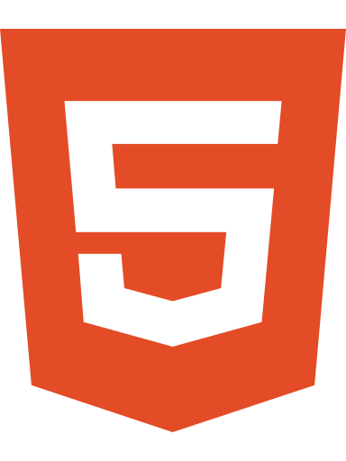
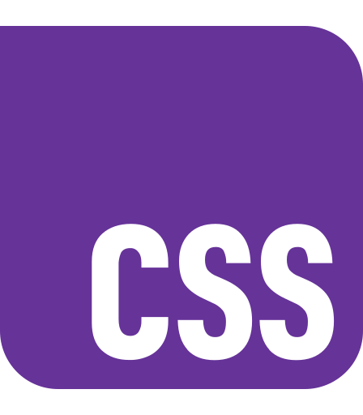
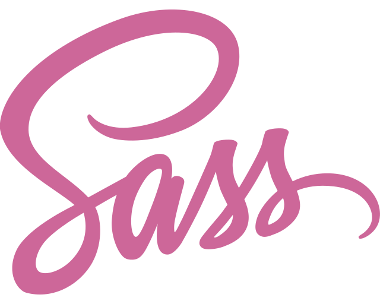
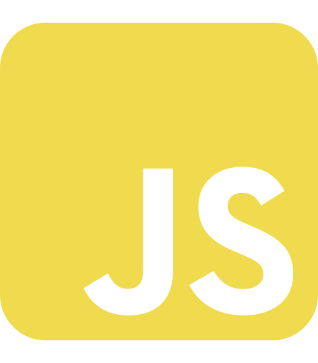
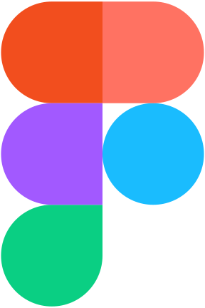
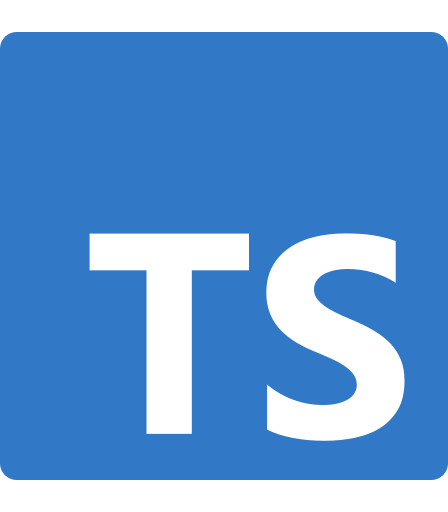
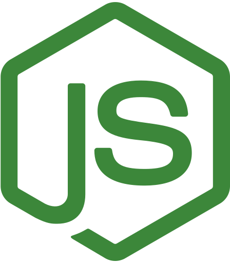
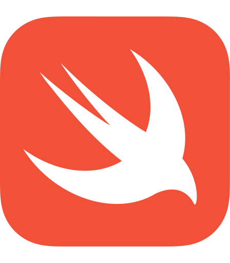
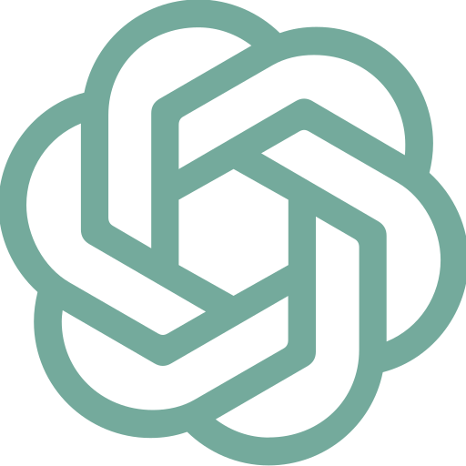
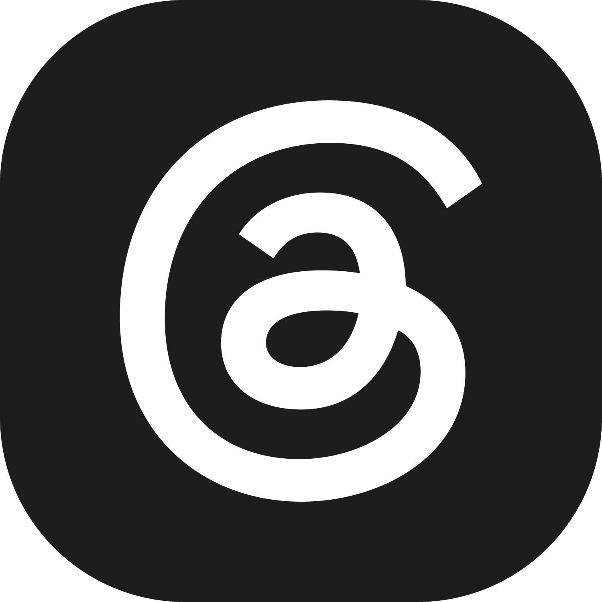

# Bonjour 👋, je m'appelle Mikaël Posty ! Mais tu peux m'appeler Mike.

## Un profil communication digitale & social media, avec une vraie culture web et une passion assumée pour le code 🚀

  

Curieux de tout, j'ai toujours aimé comprendre comment fonctionnent les choses, notamment le web. J'ai commencé avec WordPress, avant de passer au code : d'abord avec les bases en HTML/CSS, puis en allant plus loin avec JavaScript et React.

Comme j'aime autant la qualité technique que la qualité esthétique, je m'intéresse aussi au webdesign, à l'UX/UI, au responsive design, à l'accessibilité et au SEO.

En parallèle, je travaille depuis plusieurs années dans la communication digitale et le social media. Aujourd'hui, je poursuis mon parcours en communication & marketing digital à l'ISCOM Paris, avec l'objectif d'aller encore plus loin et de renforcer mes compétences.

Ce GitHub est là pour documenter mes apprentissages, mes projets personnels et les formations que j'ai suivies, avec l'envie de progresser au fil du temps et de mieux comprendre le web, autant côté contenu que côté code.

## Quelques infos sur moi

- 🌍 **Localisation :** France 🇫🇷
- 💬 **Cœur de métier :** communication digitale, social media, contenu et projets web
- 🌱 **Compétences web :** HTML, CSS/Sass, JavaScript, React, WordPress, SEO
- 🎨 **Culture design :** UX/UI, webdesign, responsive design, accessibilité
- 📖 **J'apprends / j'explore :** TypeScript, Node.js, Python, Swift, Ghost et les usages de l'IA dans les projets
- 📝 **Site personnel :** [mikaelposty.fr](https://mikaelposty.fr)
- 📫 **Pour me contacter :** [hello@mikepixel.dev](mailto:hello@mikepixel.dev)
- ⚡ **Fun fact :** geek dans l'âme, photographe urbain, amateur de comics, d'animés et de voyages, toujours prêt à explorer un nouveau sujet ou à ouvrir un fichier CSS "juste pour voir".

## Ce que vous trouverez ici

- Des projets réalisés dans le cadre de mes formations OpenClassrooms
- Des expérimentations HTML/CSS, responsive design, accessibilité et SEO
- Des projets WordPress, contenus web et prototypes personnels
- Des tests autour de JavaScript, React et de l'intégration front-end
- Une approche projet avec documentation, conventions de commits, branches et README propres

## Découvrez mes projets OpenClassrooms

J'ai réalisé plusieurs projets dans le cadre de mes formations OpenClassrooms, notamment en intégration web, JavaScript, React, WordPress et gestion de projet digital.

Tous les projets ne sont pas publics, mais ceux qui le sont permettent de montrer ma progression technique, ma façon de structurer un projet et mon attention portée à la documentation.

👉 [Voir mon organisation OpenClassrooms](https://github.com/Mike-OpenClassRooms)

## Langages, technos & outils

### Je pratique

&emsp;
&emsp;
&emsp;
&emsp;
&emsp;
&emsp;

### J'apprends / j'explore

&emsp;
&emsp;
&emsp;

## IA & assistance au travail

J'utilise les outils d'IA comme assistants de réflexion, de veille, de documentation, de correction et parfois de pair programming.

Je préfère comprendre ce que je produis plutôt que déléguer aveuglément : l'IA m'aide à accélérer, comparer des approches et progresser, mais je garde la main sur les choix, la structure et la cohérence des projets.

&emsp;
&emsp;
&emsp;
&emsp;
&emsp;
&emsp;

## Connectons-nous

&emsp;
&emsp;
&emsp;

---

🇬🇧 [English version](./README.en.md)
